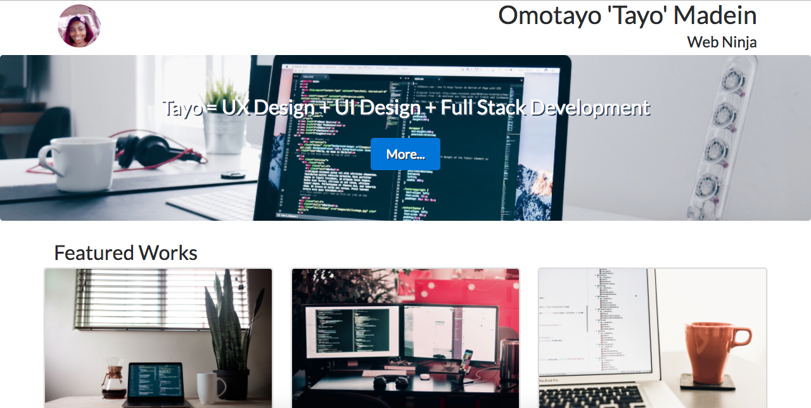

# FSND Project 2: Build a Portfolio Site
#### by Omotayo Madein

## Description

This is a responsive portfolio website created as project 2 for [Udacity Full Stack Web Developer Nanodegree](https://www.udacity.com/course/full-stack-web-developer-nanodegree--nd004). The website uses HTML, CSS, and the Bootstrap Framework.

## Project contents

This project consists for the following files:

* index.html - The entry point to the portfolio site (html file)
* css/styles.css - The main stylesheet for the site, separated from the structure (index.html)
* img/ - This is a folder for any local images to the be used. All current images are hosted by [unsplash.com](unsplash.com)

## How to run

* Step 1: 

Clone this repo to your desktop
```
git clone https://github.com/tayomadein/fsnd-portfolio.git
```
___or___
Download this repo as a zipped file from [Github](https://github.com/tayomadein/fsnd-portfolio/archive/master.zip)

* Step 2:

Double click ```index.html``` to open in your default browser


## Screenshots

